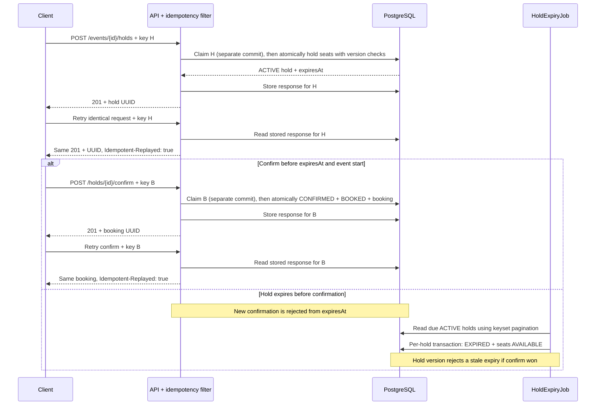

# seatlock

A Java backend that reserves event seats with expiring holds, prevents double booking under contention, and replays idempotent retries.

[](https://github.com/srujanmalakpata/seatlock/actions/workflows/ci.yml)
[](LICENSE)
[](pom.xml)

## Highlights

- **One winner under contention:** 50 simultaneous holds on one seat yield 1 × 201 and 49 × 409;
  `ConcurrencyIT.exactlyOneOfManyParallelHoldsForTheSameSeatWins` checks the database afterwards
  ([verification, row 4](VERIFICATION.md#summary)).
- **One booking under concurrent confirmation:** 20 confirms produce one booking and 19 × 409,
  enforced by `ConcurrencyIT.parallelConfirmsOfOneHoldCreateExactlyOneBooking`
  ([row 20a](VERIFICATION.md#summary)).
- **Retries return the original response:** a PostgreSQL-backed idempotency filter replays status,
  body and Location; `IdempotencyIT.concurrentRetriesWithOneKeyCreateOneHold` checks 20 concurrent
  retries with one key ([test inventory](VERIFICATION.md#test-inventory-from-2)).
- **Locking tested by removal:** removing either seat or hold `@Version` makes concurrency tests
  fail; removing the expiry keyset cursor fails 4 of 6 expiry unit tests
  ([mutation checks, rows 7–12](VERIFICATION.md#summary)).
- **124 test cases against the real persistence model:** 97 unit/slice + 27 PostgreSQL integration
  cases passed in the recorded Linux run, with 97.4% line coverage
  ([rows 2–3](VERIFICATION.md#summary)).

**Tech stack:** Java 21 · Spring Boot 3.5 · Spring Data JPA / Hibernate · PostgreSQL 16 · Flyway ·
Testcontainers · JUnit 5 · JaCoCo · Micrometer / Prometheus · Docker Compose · Maven.

Validated locally, never deployed; no real users or production traffic. The figures above are
historical correctness checks, not load benchmarks. See the
[current validation results](VERIFICATION.md#local-recheck-2026-10-03) for what was rerun and what
this environment blocked.

[Quickstart](#quickstart) · [Architecture](#architecture) · [Sample curl session](#sample-curl-session) ·
[Features](#features) · [Configuration](#configuration) · [Testing](#testing) ·
[Results](#results) · [Limitations](#limitations) · [Design rationale](DESIGN.md) · [License](#license)

## Quickstart

Requirements: Git, Docker with Compose and Buildx, a running Docker engine, curl and Python 3
(for the smoke test). Ports 8080 and 5432 must be free. Java 21 is needed only for source builds;
the container build supplies Java and Maven. The Maven wrapper downloads Maven 3.9.11.

```bash
git clone https://github.com/srujanmalakpata/seatlock.git
cd seatlock
docker compose up --build --detach --wait --wait-timeout 180
curl -fsS http://localhost:8080/actuator/health
./scripts/smoke-test.sh http://localhost:8080
```

Open [Swagger UI](http://localhost:8080/swagger-ui.html) to explore the API, or use the curl
session below. Expected smoke output ends with `SMOKE TEST PASSED`. Stop the stack with
`docker compose down` (keeps the database volume).

## Architecture

```mermaid
flowchart LR
  C[HTTP client] --> F[IdempotencyFilter<br/>POST + Idempotency-Key]
  F --> W[Controllers<br/>EventController / ReservationController]
  W --> S[Services<br/>EventService / ReservationService]
  S --> D[Domain entities<br/>Event, Seat, Hold, Booking<br/>state transitions + @Version]
  S --> R[Spring Data JPA repositories]
  F --> I[(idempotency_record)]
  R --> P[(PostgreSQL<br/>Flyway schema)]
  J[HoldExpiryJob<br/>@Scheduled] --> S
  W -. errors .-> E[ApiExceptionHandler<br/>RFC 7807 problem+json]
  A[Actuator + Micrometer] -. /actuator/prometheus .-> M[Prometheus]
```

### Hold → book, retry and expiry



Response storage follows the business commit in a separate transaction; the crash window is
documented under [Limitations](#limitations).

```
src/main/java/dev/seatlock/
  domain/        entities + state machines (Seat, Hold, Booking, Event), SeatMapLayout, exceptions
  repository/    Spring Data JPA interfaces (+ a JPQL availability aggregate, a Specification filter)
  service/       EventService, ReservationService (transactions), HoldExpiryJob, metrics
  web/           controllers, request/response records, ApiExceptionHandler (problem+json)
  idempotency/   IdempotencyFilter, JDBC store (INSERT ... ON CONFLICT DO NOTHING), cleanup job
  config/        typed properties (seats.*), Clock, scheduling switch, OpenAPI metadata
src/main/resources/db/migration/   V1 schema, V2 (drop a redundant index, CHECK on booking totals)
```

Seat lifecycle: `AVAILABLE -> HELD -> BOOKED`, back to `AVAILABLE` on release, expiry or
cancellation. Hold lifecycle: `ACTIVE -> CONFIRMED | RELEASED | EXPIRED`.

Design rationale, alternatives and known gaps are in [DESIGN.md](DESIGN.md).

## Sample curl session

Run this block in Bash after Quickstart. Python extracts the returned UUIDs, creates fresh
idempotency keys, and sets the event start to tomorrow. Complete confirmation before the
hold's default five-minute TTL.

```bash
set -euo pipefail
BASE_URL=http://localhost:8080
json() { python3 -c "import json,sys; print(json.load(sys.stdin)$1)"; }
EVENT_BODY=$(python3 - <<'PYTHON'
import json
from datetime import datetime, timedelta, timezone
print(json.dumps({
    "name": "Jazz Night", "venue": "Main Hall",
    "startsAt": (datetime.now(timezone.utc) + timedelta(days=1)).isoformat(),
    "sections": [{"name": "FLOOR", "rows": 2, "seatsPerRow": 5, "priceCents": 5000}]
}))
PYTHON
)
EVENT_ID=$(curl -fsS -X POST "$BASE_URL/api/v1/events" \
  -H 'Content-Type: application/json' -d "$EVENT_BODY" | json "['id']")
SEAT_ID=$(curl -fsS "$BASE_URL/api/v1/events/$EVENT_ID/seats?status=AVAILABLE&size=1" \
  | json "['items'][0]['id']")
HOLD_KEY=$(python3 -c 'import uuid; print(uuid.uuid4())')
HOLD_BODY="{\"seatIds\":[\"$SEAT_ID\"],\"customerRef\":\"cust-42\"}"
HOLD_ID=$(curl -fsS -X POST "$BASE_URL/api/v1/events/$EVENT_ID/holds" \
  -H 'Content-Type: application/json' -H "Idempotency-Key: $HOLD_KEY" \
  -d "$HOLD_BODY" | json "['id']")

# Retry the identical hold request: same hold UUID, Idempotent-Replayed: true.
curl -fsS -i -X POST "$BASE_URL/api/v1/events/$EVENT_ID/holds" \
  -H 'Content-Type: application/json' -H "Idempotency-Key: $HOLD_KEY" -d "$HOLD_BODY"

# Confirm twice with one fresh key: both return the same booking UUID and HTTP 201.
CONFIRM_KEY=$(python3 -c 'import uuid; print(uuid.uuid4())')
for attempt in 1 2; do
  curl -fsS -i -X POST "$BASE_URL/api/v1/holds/$HOLD_ID/confirm" \
    -H "Idempotency-Key: $CONFIRM_KEY"
done
curl -fsS "$BASE_URL/api/v1/events/$EVENT_ID/availability"
```

The second confirmation includes `Idempotent-Replayed: true`; availability shows `booked: 1`,
`held: 0`, `available: 9`. Without an idempotency key, confirming an already confirmed hold returns
409. Reusing a key with a different request returns 422. A new confirmation after `expiresAt`
returns 409 `hold-expired`, both before and after the sweep. A retry of a previously successful
keyed confirmation still replays its booking.

## Features

- **REST API** (`/api/v1`) with OpenAPI docs (springdoc, Swagger UI at `/swagger-ui.html`)
  - create events with a generated seat map (sections x rows x seats, per-section price)
  - paginated event and seat listings (filter by status/section), availability summary per section
  - hold seats (all-or-nothing, default 5 minute TTL), confirm a hold into a booking, release a
    hold, cancel a booking. Holds, confirmations and cancellations stop once the event has started
    (409 `event-started`)
- **No double booking**: `@Version` optimistic locking on seats (hold races) and on holds
  (confirm vs. expiry), plus `UNIQUE(booking.hold_id)` and `CHECK` constraints as a database-level
  backstop. Mutation checks show which of these the tests depend on (see Results). A 409
  `seat-unavailable` re-reads the taken seats after rollback when the request lost a write race.
  If the winner has already released all of them before that read, it reports the requested seats
- **Idempotency-Key** header supported on every POST: when supplied, the first response is stored
  in PostgreSQL and replayed for retries. A reused key with a different body gets 422, and a key
  that is still in flight gets 409 with `Retry-After`. A claim older than 30 s whose response was never recorded gets 409
  without `Retry-After`, so clients do not retry it in a loop. Keyed bodies are capped at 64 KB (413)
- **Hold expiry**: a `@Scheduled` sweeper releases seats of expired holds, one transaction per hold.
  A hold that fails to expire is logged, counted and retried on the next run. Due holds are paged
  with a keyset cursor on `(expires_at, id)`, so failing holds, even a full batch of them, cannot
  block the holds behind them. Confirming an expired hold fails even before the sweeper has run
- **Errors** are RFC 7807 `application/problem+json` with stable `type` URNs and field-level
  validation details, including a generic logged 500 for unexpected failures
- **Observability**: Spring Boot Actuator health/readiness/liveness, Micrometer Prometheus endpoint
  with business counters (`seats_holds_placed_total`, `seats_holds_conflicts_total`, ...)
- **Persistence**: PostgreSQL 16, Flyway versioned migrations (V1 schema, V2 follow-up), Spring
  Data JPA (Hibernate validates the schema)
- **Configuration** is validated at startup (for example `seats.hold-ttl=PT0S` stops the app), and
  the database credentials have no defaults outside the `local` profile, so a misconfigured
  deployment fails fast instead of using development credentials
- **Packaging**: multi-stage Dockerfile (layered jar, JRE-only, non-root user, healthcheck),
  `docker-compose.yml` with app + PostgreSQL, GitHub Actions CI (lint, unit + Testcontainers
  integration tests, coverage report, Docker build + smoke test)

## Configuration

Configuration (`application.yml`, overridable with environment variables such as
`SEATS_HOLDTTL=PT2M`): `seats.hold-ttl`, `seats.max-seats-per-hold`, `seats.expiry-sweep-interval`,
`seats.expiry-batch-size`, `seats.idempotency-retention`. `DB_URL`, `DB_USER` and `DB_PASSWORD`
are required unless the `local` profile is active (`docker-compose.yml` sets them for the app).

The `seats` listed inside hold and booking responses show each seat's *current* status. After a
booking is cancelled and its seats are held by someone else, `GET /bookings/{id}` shows a
`CANCELLED` booking whose seats are `HELD`. The booking's own `status` is the record of what
happened to it.

## Testing

To run from source with Java 21, stop the containerized app if it is running, then start PostgreSQL
and use the local profile (development credentials only):

```bash
docker compose stop app
docker compose up --detach --wait postgres
./mvnw spring-boot:run -Dspring-boot.run.profiles=local
```

```bash
./mvnw test             # 97 unit + MockMvc slice test cases, no Docker needed
./mvnw verify           # + 27 integration tests on PostgreSQL 16 via Testcontainers, JaCoCo report
./mvnw spotless:check   # formatting/lint gate (google-java-format)
```

Testcontainers must be able to reach Docker independently of the CLI's selected context. On
Colima, set `DOCKER_HOST=unix://$HOME/.colima/default/docker.sock` and
`TESTCONTAINERS_DOCKER_SOCKET_OVERRIDE=/var/run/docker.sock` in the shell running `verify`.

- **Unit**: seat/hold/booking state machines, seat-map generation, `ReservationService` with
  Mockito (including a simulated lost optimistic-lock race, event-start rules and cancellation),
  expiry job keyset paging, configuration validation, and the idempotency filter against an
  in-memory store
- **API slice** (`@WebMvcTest`): status codes, `Location` headers, problem+json bodies, validation
  errors, pagination parameters
- **Integration** (`*IT`, Testcontainers PostgreSQL, real HTTP): full lifecycle, all-or-nothing
  holds, the event-start cut-off, pagination order, database CHECK constraints, expiry with a
  controllable clock, the real `@Scheduled` sweep (Awaitility, its own Spring context), idempotent
  replays (including 20 concurrent retries with one key), idempotency-record cleanup,
  Actuator/Prometheus/OpenAPI
- **Concurrency** (`ConcurrencyIT`): 50 parallel holds on one seat, 50 parallel holds that each
  want the contested seat plus their own free seat (every 409 must name only the contested seat),
  40 overlapping random two-seat holds, and 20 parallel confirms of one hold, each released at
  once behind a latch. Then 30 rounds of an HTTP confirm racing the expiry job, 20 rounds of a
  release racing a confirm, and a deterministic test of the one interleaving that only the hold's
  version catches. The database is checked after each race.

## Results

Measured on a 4-vCPU Linux container (shared with other jobs), 2026-10-03. The test record is in
[VERIFICATION.md](VERIFICATION.md).

| Measurement | Result |
|---|---|
| Tests | 97 unit/slice + 27 integration = 124 test cases (111 test methods; two are parameterized), 0 failed |
| Line / branch coverage (JaCoCo, unit + IT merged) | 97.4% / 89.1% |
| 50 parallel `POST /holds` for one seat | 1 x 201, 49 x 409, in all 3 runs (1436, 1757, 915 ms wall time) |
| 50 parallel holds, each for the contested seat plus its own free seat | 1 x 201; every 409 named only the contested seat, in all 3 runs |
| 20 parallel confirms of one hold | 1 booking, 19 x 409 |
| HTTP confirm racing the expiry job, 30 rounds x 3 runs | every round consistent; confirm won 8 / 14 / 8 times, expiry 22 / 16 / 22, and the expiry lost a version check 8 / 11 / 5 times |
| Release racing confirm, 20 rounds x 3 runs | every round consistent; confirm won 7 / 3 / 3 times, release 13 / 17 / 17 |
| Mutation: `@Version` removed from `Seat` (field set to `0L`) | killed: 10 of 50 requests "won" the same seat (20 with a 20-connection pool) |
| Mutation: `@Version` removed from `Hold` | killed: a confirmed hold ended up `EXPIRED`, and a confirm and a release of one hold both succeeded |
| Mutation: lost-race 409 lists every requested seat | killed by the contested-seat-plus-free-seat test |
| Mutation: expiry sweep without its keyset cursor | killed by the unit tests (4 of 6 fail) |
| Mutation: `UNIQUE(booking.hold_id)` removed | all tests still pass, so the constraint is defence in depth |
| `./mvnw clean verify` wall time | 2 min 8 s (includes PostgreSQL container start) |
| Docker image build (warm BuildKit Maven cache) / image size | 1 min 22 s / 406 MB as reported by `docker image ls` (a cold `--no-cache` build took 4 min 3 s) |
| Scheduled expiry in the container (TTL 3 s, sweep every 1 s) | hold `EXPIRED`, seat available again |

These are correctness checks, not a throughput benchmark. No load test was run. Timings varied
about 2x between runs in the shared container.

## Limitations

- Validated, never deployed; no real users or production traffic. CI builds, tests and runs a
  container smoke test; the badge links to hosted workflow status. This local recheck did not
  query or trigger GitHub Actions. There is no deployment (CD) stage
- No authentication or ownership checks. `customerRef` is an opaque, self-asserted client string,
  so anyone who knows a hold or booking id (random UUIDs, effectively bearer tokens) can confirm,
  release or cancel it. Idempotency-Keys are global rather than scoped per client/API key, so two
  clients that send the same key and the same body would get each other's stored response
- If the process crashes after the business transaction commits but before the response is
  recorded, that key stays `IN_PROGRESS` until the cleanup job removes it after the retention
  period (24 h). Retries get 409, without `Retry-After` once the claim is older than 30 s. The
  booking itself is safe
- Seats whose hold has expired show as `HELD` until the next sweep (default every 5 s). They
  cannot be confirmed in that window, but they cannot be re-held either
- A bounded two-instance check passed for contested holds and parallel confirms against one
  database ([recorded Mac checks](VERIFICATION.md#recorded-mac-checks-2026-10-02)). Multi-instance
  expiry, idempotency, restart and failover remain untested. Expiry runs on every instance,
  which is redundant work; a lock such as ShedLock would make it single-runner
- Optimistic locking suits this workload, where most requests touch different seats. A flash sale
  where thousands of clients want one seat would get many 409s. See [DESIGN.md](DESIGN.md) for alternatives
- Single Spring Boot service with one PostgreSQL database; not microservices or a distributed
  system. No payment step, no seat-map editing after creation

## License

MIT. See [LICENSE](LICENSE).
